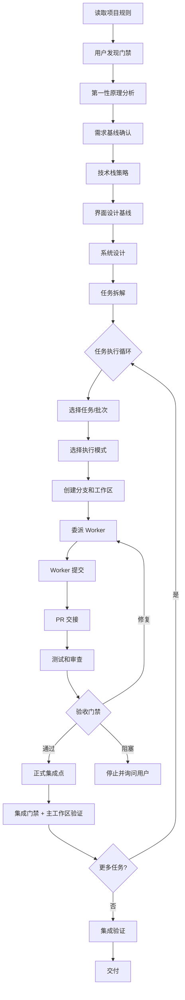

# WebBuilder 产品与使用指南

本文档是 WebBuilder 的完整产品说明和使用指南，描述 WebBuilder 产品的定位、组成、工作流和命令参考。

## 产品定位

WebBuilder 是一个轻量级 Skill，用来指导 AI 编程智能体完成全栈 Web 项目的交付流程。它以显式状态文件作为项目记忆，通过可恢复、可审查、可验证的工作流，让智能体从需求出发，逐步完成设计、拆解、开发、验证、修复和交付。

WebBuilder 不是运行时框架、代码生成器、MCP Server、后台调度器或项目模板。

## 产品边界

WebBuilder 会帮助智能体：

- 在实现前读取项目规则
- 建立需求基线，通过第一性原理分析记录核心目标、硬约束、假设证据和阻塞问题
- 推荐并记录技术栈策略
- 在前端开发前定义界面设计基线
- 产出系统设计
- 将工作拆解成有边界的小任务
- 根据宿主容量和任务风险选择单会话、委派或并行执行模式
- 通过 PR/worktree 交接推进任务
- 按任务风险升级审查
- 在 Git 项目中默认使用 task branch 和 worktree 隔离开发任务
- 记录验证证据和交付说明

WebBuilder 不会：

- 根据一句提示生成完整应用
- 提供全栈代码模板
- 作为后台服务运行
- 自动调度 worker 池
- 调用 Claude 或外部 AI 服务充当 worker
- 提供 MCP Server 或全局 CLI
- 自动部署应用
- 替代用户对高影响决策的确认

## 适用场景

WebBuilder 适合：

- 需要从需求到交付完整流程管理的全栈 Web 项目
- 需要可审计工作流的团队项目
- 需要在交付过程中保持项目记忆和状态追踪的场景
- 需要风险分级审查和证据记录的项目

WebBuilder 不适合：

- 一句话生成完整应用的场景
- 不需要工作流管理的简单脚本
- 无人值守的自动化流水线

## 包组成

WebBuilder 由以下部分组成：

```text
webbuilder/
  SKILL.md                          # 主入口，激活和工作流指令
  agents/
    openai.yaml                     # OpenAI 兼容的智能体配置
  references/
    project-results-and-usage.md    # 本文档：产品与使用指南
    delivery-checklist.md           # 交付检查清单
    install.md                      # 安装说明和激活示例
    interface-design.md             # 界面设计基线规则
    loop-engineering.md             # Loop Engineering 模型
    multi-agent-orchestration.md    # 多智能体编排规则
    reasoning-and-review.md         # 第一性原理和对抗性审查
    role-protocol.md                # 角色协议
    state-files.md                  # 状态文件模板和更新规则
    task-breakdown.md               # 任务拆解规则
    technology-strategy.md          # 技术栈策略规则
    worktree-mode.md                # PR/worktree 交接规则
  scripts/
    init-state.py                   # 初始化状态文件
    check-state.py                  # 状态结构和阶段验证
    check-host.py                   # 宿主能力检查
    capture-evidence.py             # 捕获验证证据
    migrate-state.py                # 状态迁移
    transition-state.py             # 状态转换和恢复
    approve-contract.py             # 合约审批
    contract_core.py                # 合约核心逻辑（内部）
    evidence_core.py                # 证据核心逻辑（内部）
    host_capabilities.py            # 宿主能力检查逻辑（内部）
    state_schema.py                 # 状态 schema 定义（内部）
    state_transition.py             # 状态事务引擎（内部）
```

### 用户命令

以下脚本是用户直接使用的命令：

| 脚本 | 用途 |
|---|---|
| `init-state.py` | 在目标项目中初始化七个状态文件 |
| `check-state.py` | 验证状态结构和阶段就绪性 |
| `check-host.py` | 检查宿主能力并记录结果 |
| `capture-evidence.py` | 捕获验证命令的确定性证据 |
| `migrate-state.py` | 将旧版状态迁移到当前 schema |
| `transition-state.py` | 应用或恢复状态转换 |
| `approve-contract.py` | 审批或失效化解决方案合约 |

### 内部辅助模块

以下脚本是内部实现，不直接调用：

| 脚本 | 职责 |
|---|---|
| `contract_core.py` | 合约材料提取、摘要计算、修订验证 |
| `evidence_core.py` | 证据清单持久化、密钥脱敏、实现指纹 |
| `host_capabilities.py` | 本地能力探测、显式报告合并、能力验证 |
| `state_schema.py` | 状态目录名、schema 版本、必要文件列表、顶层值读写 |
| `state_transition.py` | 原子写入、文件锁、事务日志、恢复引擎 |

## 安装

请安装整个 `webbuilder/` 文件夹，而不是只复制 `SKILL.md`。

### Codex

个人安装路径：`~/.codex/skills/webbuilder/`

```powershell
git clone https://github.com/Zboo-0324/spec2web.git
Set-Location spec2web

$src = (Resolve-Path ".\webbuilder").Path
$dst = "$env:USERPROFILE\.codex\skills\webbuilder"

New-Item -ItemType Directory -Force -Path (Split-Path $dst) | Out-Null
robocopy $src $dst /MIR
```

安装后重启 Codex。

### Claude Code

个人安装路径：`~/.claude/skills/webbuilder/`

项目安装路径：`.claude/skills/webbuilder/`

```powershell
git clone https://github.com/Zboo-0324/spec2web.git
Set-Location spec2web

$src = (Resolve-Path ".\webbuilder").Path
$dst = "$env:USERPROFILE\.claude\skills\webbuilder"

New-Item -ItemType Directory -Force -Path (Split-Path $dst) | Out-Null
robocopy $src $dst /MIR
```

安装后重启 Claude Code。

### Hermes

个人安装路径：`~/.hermes/skills/webbuilder/`

```powershell
git clone https://github.com/Zboo-0324/spec2web.git
Set-Location spec2web

$src = (Resolve-Path ".\webbuilder").Path
$dst = "$env:USERPROFILE\.hermes\skills\webbuilder"

New-Item -ItemType Directory -Force -Path (Split-Path $dst) | Out-Null
robocopy $src $dst /MIR
```

安装后重启 Hermes。

### 安装验证

安装后可以通过以下方式验证：

```powershell
# 验证 Skill 包结构
python -X utf8 "$env:USERPROFILE\.codex\skills\.system\skill-creator\scripts\quick_validate.py" webbuilder

# Smoke check
$tmp = Join-Path $env:TEMP "webbuilder-smoke"
Remove-Item -Recurse -Force -LiteralPath $tmp -ErrorAction SilentlyContinue
New-Item -ItemType Directory -Force -Path $tmp | Out-Null
python webbuilder/scripts/init-state.py --target $tmp
python webbuilder/scripts/check-state.py --target $tmp --phase structure
```

## 快速开始

### 激活方式

当你希望启用 WebBuilder 工作流时，显式调用它：

```text
/webbuilder initialize this project
/webbuilder enable workflow
/webbuilder start from requirements.md
/webbuilder start autonomous from requirements.md
/webbuilder continue current task
/webbuilder show status
/webbuilder generate delivery report
```

自然语言等效：

```text
use WebBuilder for this project
start WebBuilder mode
resume WebBuilder
```

WebBuilder 不应该自动接管普通编码任务。只有当用户显式要求，或项目中存在 active 的 `webbuilder/loop-state.md` 时，它才持续约束后续全栈开发工作。

### 引导模式与自主模式

`loop-state.md` 记录 `delivery_mode: guided | autonomous`。

**引导模式**（默认）保持一次一个问题的对话，用户确认后设置 `discovery_method: interactive`。

**自主模式**内部起草相同的需求、系统设计和任务计划制品，不进行逐问题对话。它设置 `discovery_method: inferred_contract`，运行规格阶段就绪检查，向用户呈现一份合并的合约，等待审批后继续。

两种模式共享相同的合约审批流程：

```text
python <skill-root>/scripts/check-state.py --target <project-root> --phase specification
python <skill-root>/scripts/approve-contract.py --target <project-root> --approval-evidence <user-message-reference>
```

### 基本流程

一个完整的 WebBuilder 项目经历以下阶段：

1. 读取项目规则
2. 用户发现门禁
3. 第一性原理分析
4. 需求基线确认
5. 技术栈策略
6. 界面设计基线
7. 系统设计
8. 任务拆解
9. 任务执行循环
10. 集成验证
11. 交付



## 完整交付工作流

### 任务执行循环

单个任务的完整执行循环：

```text
读取状态
-> 选择下一个任务或并行批次
-> 选择 single/delegated/parallel 执行模式
-> 创建 Task Branch 和 Worktree（Git 可用时）
-> 委派 Worker 并提供 Task Contract
-> Worker 在 Task Branch 上提交
-> PR 交接提交
-> 测试和审查
-> 验收门禁
-> 正式集成点
-> 集成门禁 + 主工作区验证
-> 修复或记录
-> 更新状态
```

一个任务完成后，只要 `loop-state.md` 仍为 active，且下一个任务依赖满足、验证方法明确、没有停止条件，Orchestrator 就继续推进下一个任务。

### 执行模式

WebBuilder 根据宿主容量和任务风险选择三种执行模式：

- **single**：在主会话中完成，适用于小型、耦合、非 Git 或不可委派的任务
- **delegated**：一个 Worker 执行一个有界任务，然后由独立检查器审查
- **parallel**：在独立 worktree 中分配经验证的无冲突任务批次

模式选择规则：

- 不要仅因为存在空闲 slot 就委派
- `high` 和 `critical` 任务不得使用 `single_session` 检查策略
- 并行批次需要通过 `--phase parallel` 门禁

### 合约审批边界

合约审批不授权以下行为：

- 凭据或密钥
- 付费资源或服务
- 生产部署
- 破坏性外部写入
- 不可逆迁移
- 高风险安装脚本
- 密钥传输

执行需要上述任何行为时，必须停止并询问用户。

## 七个状态文件

WebBuilder 在项目中维护七个状态文件：

| 文件 | 用途 | 状态流转 |
|---|---|---|
| `project-rules.md` | 记录实现相关规则 | `draft` -> `ready` |
| `requirements-baseline.md` | 持有已确认的需求 | `draft` -> `confirmed` |
| `system-design.md` | 冻结设计事实 | `draft` -> `ready` |
| `task-plan.md` | 任务队列 | `draft` -> `ready` |
| `loop-state.md` | 规范的 State Kernel 记录 | `active`/`paused`/`blocked`/`disabled`/`delivered` |
| `validation-log.md` | 保留验证证据 | 持续追加 |
| `delivery-report.md` | 最终用户交接 | `draft` -> `complete` |

这些文件是项目记忆的事实来源。对话上下文不能替代它们。

### State Kernel 行为

`loop-state.md` 是规范的 State Kernel 记录。Schema 1.4 要求以下字段：

- `delivery_mode`：`guided` 或 `autonomous`
- `autonomy_scope`：`unconfirmed` 或 `confirmed_plan`
- `stop_reason`：停止原因
- `resume_checkpoint`：恢复检查点
- `active_run_id`：活跃运行 ID
- `state_revision`：状态修订号
- `pending_transition`：待处理的转换 ID

智能体可以编辑描述性内容并提交证据，但不得手动设置审批、就绪、验收、集成、停止/恢复或交付成功值。状态变更通过 `webbuilder/.transitions/` 下的事务日志进行；恢复只会完成未发生分歧的待处理事务。

使用 `transition-state.py --event <event>` 进行生命周期变更。生命周期事件在内部构建控制更新并拒绝 `--set`。支持的事件包括：`confirm-user-discovery`、`confirm-requirements`、`mark-project-rules-ready`、`mark-system-design-ready`、`mark-task-plan-ready`、`start-task`、`submit-task`、`accept-task`、`complete-task-integration`、`complete-delivery-report`、`pause`、`block`、`resume`、`deliver`。

`edit-descriptive-content --set <file:key=value>` 是唯一的通用更新形式，它拒绝所有生命周期控制键。

## 十一个验证阶段

检查脚本提供十一个验证阶段：

### 结构验证（structure）

检查 schema、必要文件、智能体编排元数据、设计章节、任务契约和状态取值。验证 `loop-state.md` 的所有必要标记、schema 版本、执行模式、宿主能力、可用 slot 数、worker 数和活跃检查策略。

### 规格验证（specification）

验证完整合约材料、无 `not recorded` 值、非空验收信号和主工作流、系统设计与任务计划引用当前合约修订。在审批前允许 `confirmation_status: pending`；在执行就绪时要求 `approved` 且修订和摘要匹配。

### 执行验证（execution）

要求已确认需求、就绪的规则/设计/任务基线、无占位内容和 active 工作流。验证 `discovery_status: confirmed`。

### 任务验证（task）

检查选定任务、依赖、任务级审核策略、执行模式、交接方式、工作区和当前任务状态。验证 `risk_level` 已分类、`handoff_mode` 与 `execution_mode` 一致、`allowed_paths` 和 `verification` 非空。

### 并行验证（parallel）

检查宿主容量、批次大小、独立 worktree、路径与声明式语义冲突、每任务审核策略。验证 `allowed_paths` 不重叠、共享资源和冲突域不交叉、集成依赖不要求串行。

### 验收验证（acceptance）

检查逐任务提交包、身份独立性、对抗性案例、分歧和 critical 控制证据。验证 Developer、Tester、Reviewer 身份在 `separate_tester_reviewer` 策略下全部不同。

### 集成验证（integration）

检查已验收任务、集成策略与提交、主工作区复验证据。验证集成策略与任务契约匹配、`main_workspace_verification: passed`。

### 交付验证（delivery）

要求所有任务的验收和集成证据闭环、交付报告完成和终态工作流。验证每个必要验证域都有有效的证据清单。

### 宿主能力验证（`host`）

验证合约中标记为 `required` 的宿主能力已可用且有证据。

### 初始化验证（`initialization`）

验证宿主能力满足已批准合约，`not_applicable` 能力可跳过。

### UI 验证（`ui`）

合约声明 `ui` 为 `required` 时，验证 UI 证据清单存在。

## 角色

WebBuilder 围绕固定的 Orchestrator 分离职责：

| 角色 | 职责 |
|---|---|
| Orchestrator | 维护状态、选择任务、选择安全并行批次、控制集成 |
| Planner | 分析需求、设计系统、拆解任务 |
| Developer | 在任务边界内实现一个任务 |
| Tester | 验证行为和需求覆盖 |
| Reviewer | 只读审查范围、代码质量、风险和工作流合规 |
| Repairer | 使用显式证据修复失败 |
| Delivery | 准备最终报告 |

对于普通委派工作，一个独立的 `independent_checker` 可以合并 Tester 和 Reviewer 职责。`high` 和 `critical` 任务需要 `separate_tester_reviewer` 和对抗性审查。Tester、Reviewer 和 Developer 身份在声明策略要求时必须不同。Developer 不得自我认证完成或集成。

## PR/Worktree 交接

WebBuilder 对 Git 项目中的委派或并行任务使用 PR/worktree 交接：

- 默认一次执行一个任务
- 受控多 worker 模式只允许无冲突任务批次
- Orchestrator 创建 task branch 和 worktree
- 子代理 worker 只在自己的 worktree 中开发并提交到 task branch
- worker 提交本地 PR 包或远程 PR 后停止
- Orchestrator 通过 `merge`、`squash_merge`、`cherry_pick` 或 `integration_commit` 串行集成
- 每次集成后都需要在主工作区重新验证

WebBuilder 不提供自动 worker 池，也不提供无人值守的批量集成调度器。

对于非 Git 项目或明确采用单会话回退的任务，使用 `handoff_mode: single_session` 和 `integration_strategy: direct_apply`。

## 审查策略

### 风险分级

每个任务必须声明 `risk_level`：

- `unclassified`：无证据支持风险判断，不得调度
- `low`：局部、可逆、低影响工作
- `standard`：普通功能或维护工作
- `high`：安全、权限、迁移、并发、外部集成、共享合约、破坏性操作
- `critical`：发布关键或不可逆工作，或有重大用户/财务/数据丢失/安全/合规影响

### 对抗性审查

`high` 和 `critical` 任务需要在调度前定义 `adversarial_review` 案例。它们必须测试可信的失败路径，而非泛泛的"检查边界情况"。

Tester 记录观察到的行为。Reviewer 记录证据是否解决了声明的失败路径以及是否遗留新风险。失败的对抗性案例将任务退回修复或阻塞。

## 证据捕获

使用 `capture-evidence.py` 捕获验证命令的确定性证据：

```text
python <skill-root>/scripts/capture-evidence.py --target <project-root> --run <RUN-ID> --subject <TASK-ID> --attempt <N> --contract-revision <REV> -- <command>
```

证据存储在 `.webbuilder-artifacts/<run-id>/<subject-id>/<attempt>/` 下，包含 `manifest.json` 和命令输出。每个清单记录命令、退出码、实现指纹、工件哈希、脱敏状态和结果。

Worker 在其任务 worktree 中捕获证据。Orchestrator 在集成前通过 `promote_artifacts` 函数将证据提升到主工作区。

### 证据清单

每个清单包含：

- `schema_version`：清单格式版本
- `record_id`：唯一记录 ID
- `run_id` 和 `subject_id`：标识运行和主题
- `contract_revision`：合约修订号
- `implementation_fingerprint`：Git SHA-256 或直接应用指纹
- `command`：执行的命令
- `exit_code`：退出码
- `artifacts`：工件路径和哈希
- `redaction`：脱敏状态
- `result`：`passed` 或 `failed`

### 脱敏策略

所有捕获的证据在写入前自动脱敏。脱敏器剥离：

- Authorization 头（Bearer 令牌、Basic 凭据）
- Cookie 头
- 含密钥的赋值模式（TOKEN、SECRET、PASSWORD、API_KEY）

清单在内置脱敏完成后始终记录 `redaction.status: passed`。交付门禁仅接受 `redaction.status` 为 `passed` 的清单，拒绝任何其他状态。

## 宿主能力检查

在调度需要特定宿主能力的任务前，检查并验证宿主是否支持：

```text
python <skill-root>/scripts/check-host.py --target <project-root>
python <skill-root>/scripts/check-state.py --target <project-root> --phase host
python <skill-root>/scripts/check-state.py --target <project-root> --phase initialization
python <skill-root>/scripts/check-state.py --target <project-root> --phase ui
```

`check-host.py --target <project-root>` 检查并记录宿主能力报告。
就绪性门禁由 `check-state.py` 的 `--phase host`、`--phase initialization` 和 `--phase ui` 运行。

宿主能力包括：`subagents`、`browser`、`git`、`worktree`、`docker`、`network`、`persistent_session`。

在 `loop-state.md` 的 `## Host Capabilities` 部分以 JSON 块记录宿主能力证据。

## 授权边界与停止条件

### 授权边界

合约不授权以下行为：

- 凭据或密钥
- 付费资源或服务
- 生产部署
- 破坏性外部写入
- 不可逆迁移
- 高风险安装脚本
- 密钥传输

如果执行需要上述任何行为，必须停止并询问用户。

### 声明停止条件

声明停止条件是 Orchestrator 必须暂停并询问用户的显式原因。示例：

- 需求不明确
- 需要设计变更
- 修复预算耗尽
- 需要凭据或付费资源
- 没有就绪的任务

停止原因记录在 `loop-state.md` 的 `stop_reason` 中，在问题解决后通过 `resume` 事件恢复。

`workload_envelope` 块记录估计范围：任务数范围、浏览器流程、外部依赖、质量门禁、修复预算（`task: 3`、`integration: 5`）和可用并发。

## 修复预算

使用有限的修复循环：

- 任务级修复：最多 3 次尝试
- 集成级修复：最多 5 次尝试
- 相同错误指纹出现 3 次：停止

每次修复必须引用新证据、更改一个主要原因、重新运行验证并更新 `validation-log.md`。如果修复需要更改已确认需求、扩展范围、添加高风险依赖、使用真实凭据或创建付费资源，必须停止并询问用户。

任务修复计数器和集成修复计数器是独立的：`task_repair_attempt` 及其指纹字段管控任务执行和验收，`integration_repair_attempt` 及其指纹字段管控验收后的集成。

## 常用命令

### 状态管理

```powershell
# 初始化状态文件
python webbuilder/scripts/init-state.py --target .

# 迁移已有状态
python webbuilder/scripts/migrate-state.py --target . --dry-run
python webbuilder/scripts/migrate-state.py --target .

# 恢复中断的状态转换
python webbuilder/scripts/transition-state.py --target . --recover

# 结构检查
python webbuilder/scripts/check-state.py --target . --phase structure
```

### 合约审批

```powershell
# 规格验证
python webbuilder/scripts/check-state.py --target . --phase specification

# 审批合约
python webbuilder/scripts/approve-contract.py --target . --approval-evidence user-message-42

# 失效化合约（材料变更后）
python webbuilder/scripts/approve-contract.py --target . --invalidate-material-change
```

### 任务执行

```powershell
# 执行门禁
python webbuilder/scripts/check-state.py --target . --phase execution

# 任务门禁
python webbuilder/scripts/check-state.py --target . --phase task --task TASK-001

# 并行批次门禁
python webbuilder/scripts/check-state.py --target . --phase parallel --parallel-group PG-001

# 验收门禁
python webbuilder/scripts/check-state.py --target . --phase acceptance --task TASK-001

# 集成门禁
python webbuilder/scripts/check-state.py --target . --phase integration --task TASK-001
```

### 证据和交付

```powershell
# 捕获验证证据
python webbuilder/scripts/capture-evidence.py --target . --run RUN-1 --subject TASK-001 --attempt 1 --contract-revision 1 -- python -m unittest

# 宿主能力检查（检查并记录报告）
python webbuilder/scripts/check-host.py --target .

# 宿主能力就绪性门禁
python webbuilder/scripts/check-state.py --target . --phase host

# 交付门禁
python webbuilder/scripts/check-state.py --target . --phase delivery
```

### 状态转换

```powershell
# 恢复
python webbuilder/scripts/transition-state.py --target . --resume

# 交付
python webbuilder/scripts/transition-state.py --target . --deliver

# 编辑描述性内容
python webbuilder/scripts/transition-state.py --target . --event edit-descriptive-content --set "system-design.md:frontend=React"
```

## 故障排查

### 状态文件缺失或损坏

```powershell
# 重新初始化（不会覆盖已有文件）
python webbuilder/scripts/init-state.py --target .

# 结构检查
python webbuilder/scripts/check-state.py --target . --phase structure
```

### 待处理的事务阻塞

```powershell
# 恢复中断的事务
python webbuilder/scripts/transition-state.py --target . --recover

# 如果恢复失败，检查 .transitions/ 目录中的日志文件
```

### 合约审批后需求变更

```powershell
# 失效化当前审批
python webbuilder/scripts/approve-contract.py --target . --invalidate-material-change

# 更新需求后重新审批
python webbuilder/scripts/check-state.py --target . --phase specification
python webbuilder/scripts/approve-contract.py --target . --approval-evidence user-message-N
```

### 迁移失败

```powershell
# 先 dry-run 查看会变更的文件
python webbuilder/scripts/migrate-state.py --target . --dry-run

# 检查备份目录
ls webbuilder/.migration-backup-*
```

### 证据清单验证失败

检查清单文件中的：

- `contract_revision` 是否与当前审批修订匹配
- `implementation_fingerprint` 是否与当前代码状态匹配
- `redaction.status` 是否为 `passed`
- 工件文件是否存在于记录的路径

## 维护与扩展

### 添加新的验证阶段

1. 在 `check-state.py` 中添加新的 `check_*_readiness` 函数
2. 在 `check_state` 函数的分发逻辑中注册新阶段
3. 在 `main` 函数的 `--phase` choices 中添加新阶段
4. 更新本文档的验证阶段列表

### 添加新的状态文件

1. 在 `state_schema.py` 的 `REQUIRED_FILES` 中添加文件名
2. 在 `init-state.py` 的 `TEMPLATES` 中添加模板
3. 在 `check-state.py` 的 `check_structure` 中添加必要的标记检查
4. 更新本文档的状态文件列表

### 添加新的生命周期事件

1. 在 `transition-state.py` 的 `LIFECYCLE_EVENTS` 中添加事件名
2. 在 `lifecycle_updates` 函数中实现事件逻辑
3. 在 `state_schema.py` 中添加需要的辅助函数
4. 更新 `state-files.md` 中的事件表

### Schema 升级

当需要升级 schema 版本时：

1. 更新 `state_schema.py` 中的 `SCHEMA_VERSION`
2. 将旧版本号添加到 `SUPPORTED_SOURCE_VERSIONS`
3. 在 `migrate-state.py` 中实现迁移逻辑
4. 创建带时间戳的备份
5. 更新 `state-files.md` 中的版本说明

### 技术栈配置文件

WebBuilder 维护经过验证的技术栈配置文件：

```text
webbuilder/references/technology-profiles/django-5.2-lts.md
```

添加新的技术栈配置文件时，参考现有文件的格式，确保包含版本组合和启动说明。
